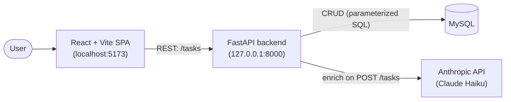

# Tidu

**Tidu** — an AI-powered task organizer that turns plain-language input into
categorized, prioritized tasks. You add tasks the way you'd say them — "finish DB
assignment by Friday, call dentist tomorrow" — and an LLM enriches each one with a
**category, priority, and due date**, so you never fill out a form. The AI is a
single, well-isolated feature inside an otherwise ordinary, robust CRUD app: the
model is a *helpful default*, not a point of failure. If the LLM is slow, down,
or returns garbage, the task is still saved with sensible defaults and the app
never crashes.


<!-- ^ Replace docs/screenshot.png with a screenshot of the running UI. -->

---

## Features

- **Natural-language task entry** — type a task the way you'd say it.
- **AI enrichment** — automatic category, priority (High/Medium/Low), and a
  resolved due date (handles "Friday", "tomorrow", "next week").
- **Graceful degradation** — bad/slow/missing AI never blocks task creation.
- **Full CRUD** — create, list (with `?category=` / `?completed=` filters),
  read, update (partial), delete.
- **Polished dashboard** — live stats (total / completed / overdue), tasks
  grouped into Overdue / Today / Upcoming / No date / Completed, color-coded
  priorities, overdue flagging, dark mode, toasts, and skeleton loaders.
- **Hermetic test suite + CI** — tests mock the model and DB, so they run
  offline, free, and with no API key.

---

## Tech stack

| Layer     | Technology                                  |
| --------- | ------------------------------------------- |
| Frontend  | React (functional components + hooks), Vite |
| Backend   | Python, FastAPI, Pydantic                   |
| Database  | MySQL (via PyMySQL)                          |
| AI        | Anthropic API — Claude Haiku (structured JSON) |
| Tests     | pytest                                       |
| CI        | GitHub Actions                               |

---

## Architecture



The backend is layered so responsibilities stay separated:

```
backend/
├── main.py         # FastAPI app + thin route handlers
├── database.py     # MySQL connection, schema bootstrap, health check
├── crud.py         # all SQL (parameterized) — the repository layer
├── models.py       # Pydantic schemas (request/response/validation)
└── ai_service.py   # the ONLY place that talks to the LLM
```

- **Routes are thin.** They validate input (Pydantic), delegate DB work to
  `crud` and LLM work to `ai_service`, and translate "not found" into a 404.
- **All SQL is parameterized** in `crud.py` (no string-formatted user input →
  SQL-injection safe).
- **The LLM is isolated** in `ai_service.py`; routes never call it directly.

---

## The AI design (the interesting part)

The enrichment step is built to be **trustworthy and crash-proof**. Four ideas
do the work:

1. **Structured JSON output.** The model is prompted to return *only* a JSON
   object with exactly `category`, `priority`, and `due_date` — no prose, no
   markdown fences — at a low temperature for consistency.

2. **Validation before trust.** The model returns *text we hope is JSON*. We
   strip accidental code fences, parse it, then validate it against a Pydantic
   model (`EnrichedTask`) whose `priority` is a closed `Literal["High",
   "Medium", "Low"]`. A response like `"priority": "Urgent"` fails validation
   and is rejected — bad values never reach the database. "Hope" becomes
   "guaranteed, or caught."

3. **Graceful fallback for every failure mode.** API error, timeout, network
   failure, malformed JSON, schema-validation failure, or a missing key — all
   funnel through one `try/except` and return safe defaults (category
   `Uncategorized`, priority `Medium`, no due date). The task **always** saves;
   the user never sees a 500 because the AI misbehaved. The failure reason is
   logged server-side (never the API key).

4. **Injected current date for relative dates.** The model has no reliable
   sense of "now", so today's date (and weekday) is passed into the prompt.
   That's what lets "by Friday" or "tomorrow" resolve to a correct calendar
   date instead of a guess.

**User input always wins.** If you explicitly set a category, priority, or due
date, the model's guess for that field is ignored — the AI only fills the blanks
you left.

---

## Setup & run

### Prerequisites
- Python 3.11+ and Node.js 18+
- A running **MySQL** server
- An **Anthropic API key** (a small/fast model like Claude Haiku is plenty)

### 1. Backend

```bash
# from the project root
python -m venv .venv
# Windows:
.venv\Scripts\activate
# macOS/Linux:
# source .venv/bin/activate

pip install -r requirements.txt
```

Create a `.env` in the project root (copy `.env.example`) and fill it in.
**Never commit `.env`** — it's gitignored.

```dotenv
# MySQL
MYSQL_HOST=127.0.0.1
MYSQL_PORT=3306
MYSQL_USER=root
MYSQL_PASSWORD=your_password_here
MYSQL_DATABASE=ai_task_organizer

# LLM (the app reads LLM_API_KEY, or falls back to ANTHROPIC_API_KEY)
LLM_API_KEY=sk-ant-your-key-here
LLM_MODEL=claude-haiku-4-5
```

Start MySQL (the app creates the database and `tasks` table automatically on
startup), then run the API:

```bash
uvicorn backend.main:app --reload
```

- API: <http://127.0.0.1:8000>
- Interactive docs (Swagger): <http://127.0.0.1:8000/docs>
- Health check: <http://127.0.0.1:8000/health>

### 2. Frontend

```bash
cd frontend
npm install
npm run dev
```

Open <http://localhost:5173>. The API base URL lives in one place —
`frontend/src/api.js` (`API_BASE_URL`).

---

## Running the tests

The suite is **hermetic**: the LLM is mocked and the database is replaced with
an in-memory store, so it needs **no API key and no MySQL**.

```bash
pip install -r requirements.txt   # pytest is included
pytest
```

All tests run offline in well under a second. Coverage focuses on what matters:
AI parsing/validation/fallback, the user-wins merge, CRUD, and request
validation (rejected priorities and unknown fields).

---

## API reference

| Method | Path          | Description                                            |
| ------ | ------------- | ------------------------------------------------------ |
| POST   | `/tasks`      | Create a task (triggers AI enrichment). Returns 201.   |
| GET    | `/tasks`      | List tasks. Supports `?category=` and `?completed=`.   |
| GET    | `/tasks/{id}` | Get one task (404 if missing).                         |
| PUT    | `/tasks/{id}` | Partial update (title/category/priority/due_date/completed). |
| DELETE | `/tasks/{id}` | Delete a task. Returns 204 (404 if missing).           |
| GET    | `/health`     | Liveness + DB connectivity.                            |

---

## Project layout

```
.
├── backend/            # FastAPI app + tests
├── frontend/           # React + Vite SPA
├── .github/workflows/  # CI
├── requirements.txt
├── pytest.ini
├── .env.example
└── README.md
```
